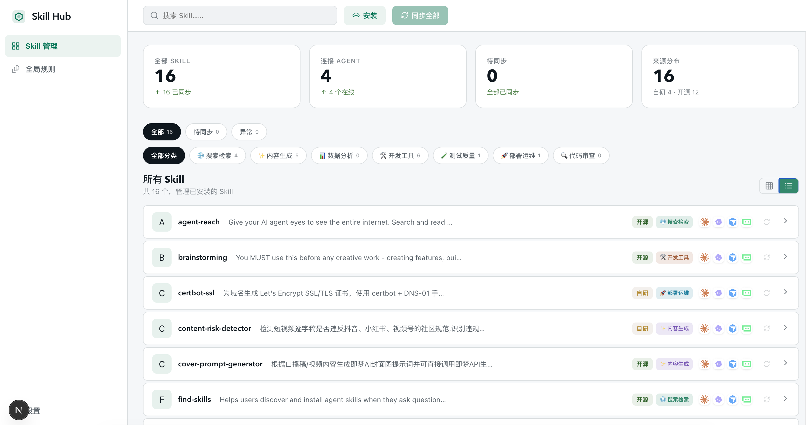

# Skills Hub

一个基于 Next.js 的本地管理工作台，用来统一查看和维护：

- skills 源文件与安装副本
- 各 agent 的同步状态和缺口
- `SKILL.md` 内容
- Claude / Codex 的全局规则文件

当前版本重点是”少跳转、少解释、直接操作”：

- 首页可以直接同步 skill、标记自制、删除安装副本、编辑分类
- 全局规则页只编辑两个现有文件：
  - `~/.claude/CLAUDE.md`
  - `~/.codex/AGENTS.md`

## 截图



## 功能概览

### 1. Skills 管理

- 浏览所有 skills 条目
- 查看各 agent 的安装状态
- 搜索、筛选待同步 / 异常 / 外部条目
- 批量同步缺失或漂移的副本
- 输入 GitHub skill 项目地址或本地目录，一次安装到所有启用的 agent skills 目录
- 直接在列表中标记“自制”或删除已安装副本
- 查看目标安装路径和 `SKILL.md` 内容

### 2. 全局规则编辑

- 在一个页面内切换 Claude / Codex 全局规则
- 支持编辑、预览、分栏预览
- 支持保存前后的脏状态提示
- 只允许更新现有全局主文件，不支持在产品内新建规则文件

## 技术栈

- Next.js 15
- React 19
- TypeScript
- Vitest
- `react-markdown` + `remark-gfm`
- `lucide-react`

## 本地启动

先安装依赖：

```bash
npm install
```

启动开发环境：

```bash
npm run dev
```

默认访问：

```text
http://localhost:3000
```

## 常用命令

```bash
npm run dev
npm run dev:reset
npm run build
npm run start
npm test
npx tsc --noEmit
```

## 目录结构

```text
app/                    Next.js 页面与 API 路由
src/components/         页面组件与工作区组件
src/lib/                扫描、同步、规则保存等核心逻辑
src/types/              类型定义
config/                 agents 与自定义 skills 配置
docs/plans/             设计与实现文档
tasks/                  任务记录与经验沉淀
tests/fixtures/         测试夹具
```

## 关键页面

- `/`：skills 管理首页
- `/instructions`：全局规则编辑页

## 关键 API

- `GET /api/overview`
- `POST /api/sync/apply`
- `POST /api/skills/install`
- `DELETE /api/sync/remove`
- `POST /api/custom-tag`
- `DELETE /api/custom-tag`
- `GET /api/instructions`
- `POST /api/instructions/update`

## 测试

项目当前主要依赖单元测试和类型检查：

```bash
npm test
npx tsc --noEmit
```

## 说明

- 这是一个偏本地工作台性质的项目，很多能力会直接读取当前机器上的目录和规则文件。
- skill 安装支持 GitHub 仓库地址和本地目录；根目录或一级子目录中包含 `SKILL.md` 的目录会被识别为 skill，目标目录已存在时会跳过而不是覆盖。
- 全局规则编辑当前刻意收敛为最小能力集，只支持编辑两个现有主文件，不支持创建额外规则层。
- 如果你准备部署到其他机器，请先确认目标环境存在对应的 agent 目录和配置文件。
